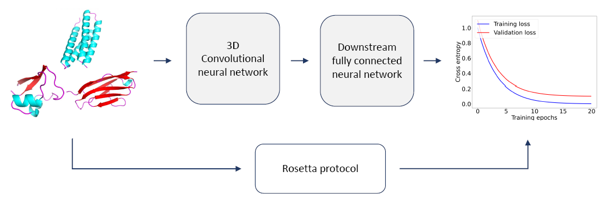

# rasp-pytorch



Reimplementation of RaSP, a deep neural network for rapid protein stability prediction, in PyTorch.
You can find the official implementation of RaSP [here](https://github.com/KULL-Centre/papers/tree/main/2022/ML-ddG-Blaabjerg-et-al).

## Installation

```bash
$ pip install rasp-pytorch
```

## Citation
```bibtex
@article{Blaabjerg2022.07.14.500157,
author = {Blaabjerg, Lasse M and Kassem, Maher M and Good, Lydia L and Jonsson, Nicolas and Cagiada, Matteo and Johansson, Kristoffer E and Boomsma, Wouter and Stein, Amelie and Lindorff-Larsen, Kresten},
doi = {10.1101/2022.07.14.500157},
journal = {bioRxiv},
publisher = {Cold Spring Harbor Laboratory},
title = {{Rapid protein stability prediction using deep learning representations}},
url = {https://www.biorxiv.org/content/early/2022/07/15/2022.07.14.500157},
year = {2022}
}
```
